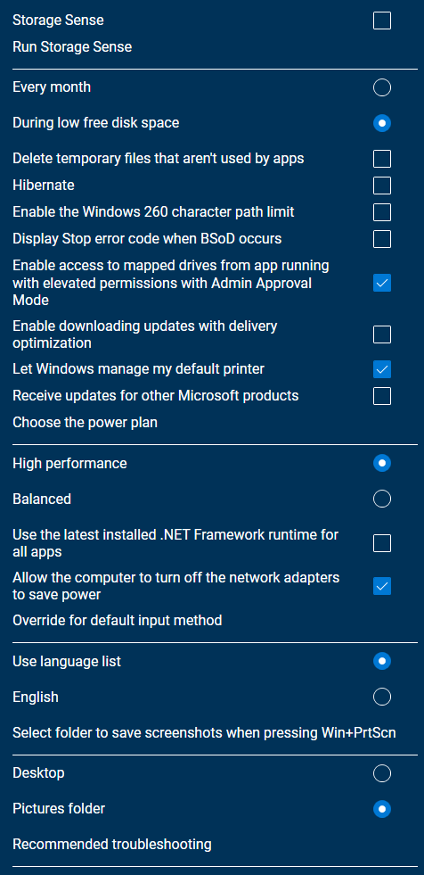

# Windows Clean Install Guide
## Requirements
- 8GB+ USB
- 1GB+ USB (optional for Backup)
---
## Check Hardware
1. Download [HWInfo](https://www.fosshub.com/HWiNFO.html)
2. Run HWiNFO64.exe
3. Click Start
4. Click "Save Report"
5. Click Next
6. Click Finish
---
## Backup Existing Files
### Directories to check:
- Desktop
- Downloads
- Documents
- Music
- Pictures
- Videos

### Check Game Libraries
- Battle.net
- Origin
- Steam
- UPlay
---
## Prepare Bootable USB
### Downloads
- [Windows 10](https://www.microsoft.com/software-download/windows10)
- [Windows 11](https://www.microsoft.com/software-download/windows11)
- [Rufus](https://github.com/pbatard/rufus/releases/latest)
- [SophiApp](https://github.com/Sophia-Community/SophiApp/releases/latest)
- [AnyDesk](https://download.anydesk.com/AnyDesk.exe)
- [YUMI](https://www.pendrivelinux.com/yumi-multiboot-usb-creator/) (if no USB is available)
- [Veeam](https://download2.veeam.com/VAW/v5/VeeamAgentWindows_5.0.3.4708.zip) (optional: for creating backup)

### Windows
#### Download ISO with MediaCreationTool
- Have at least 8GB of space on C:
- Run MediaCreationTool.exe
- Accept License Agreement
- Select "Create installation media"
- Pick language and 64-bit Architecture
- Click Next
- Select "ISO file"
- Pick location to save file

#### Flash ISO with Rufus
- Unplug all USB drives, except target USB
- Launch rufus
- Pick USB in "Device" menu
- Click "SELECT"
- Open Windows.iso
- Click "START"

### Drivers
- Create a folder named "Drivers" on your USB
- Put downloaded drivers into the folder

### Software
- Open [winget](https://winget.run/) and select software to install.
- Download the script and move it into the "Drivers" folder
- Right-Click inside the "Drivers" folder
- Select "New" and "Shortcut"
- Enter the URL of the [App Installer](ms-windows-store://pdp/?ProductId=9NBLGGH4NNS1)
- Click "Next"
- Name the Shortcut "App Installer"
- Click "Finish"
- Copy AnyDesk.exe to the "Drivers" folder
- **OPTIONAL:** Copy veeam to the "Drivers" folder if you want to create a backup later

#### List of softwares
- Browsers
    - Brave
    - Chrome
    - Firefox
    - Opera
- Tools
    - 7-zip
    - WinRAR
    - VLC
- Social
    - Discord
    - TeamSpeak
    - Zoom
- Gaming
    - EA Desktop
    - Epic Games
    - GOG
    - Steam
    - Ubisoft Connect

## Install Windows
1. Locate Boot Menu Key
2. Restart Computer
3. Spam Boot Menu Key
4. Select "UEFI: *USB Name*"
5. Select Language, Keyboard and Format
6. Click "Next"
7. Click "Install Now"
8. Click "I don't have a product key"
9. Select "Windows 10 Home/Pro" with "x64" Architecture
10. Click "Next"
11. Accept the license terms and click "Next"
12. Click "Custom: Install Windows only (advanced)"
13. Partitioning
14. Click "Next"
15. Wait for the Computer to restart
16. If Windows 10 Home is installed, disconnect from Internet
17. Select your Region and click "Next"
18. Select keyboard layout and click "Yes"
19. Add another layout or click "Skip"
20. Select "Set up for personal use" and click "Next"
21. Select "Offline Account" (bottom left)
22. Select "Limited experience" (bottom left)
23. Enter Username and click "Next"
24. Enter Password or skip with "Next"
25. Set all privacy settings to "No" and click "Accept"
26. Click "Skip"
27. Click "Not now"

## Install Drivers
- Copy Drivers from USB to Desktop
- Extract Drivers and install in following order:
    - Chipset
    - Management Engine
    - Network
    - Audio
    - USB Controller
    - Graphics Card
- Restart System

## Install Software
- Update [App Installer](https://www.microsoft.com/store/productId/9NBLGGH4NNS1) with the Shortcut
- Right click downloaded winget script and click "Run with PowerShell"

## Cleanup with SophiApp
- Extract and run the "SophiApp"
### Privacy

### Personalization

### System

### Scheduled Tasks

## Create Backup (optional)
- Unplug Windows USB
- Delete nvidia/AMD driver installer on C:
- Create new recovery Partition with Disk Management (xGB size)
- Install Veeam
- Run Recovery Media Creation Wizard
- Plug in 1GB+ USB
- Create Recovery Media
- Add Job
- Pick "Volme level backup" and click "Next"
- Tick "Operating system" and click "Next"
- Pick "Local storage" and click "Next"
- Browse to Recovery Partition and click "Next"
- Untick "Daily at" in Schedule and click "Apply"
- "Run the job when I click Finish" and click "Finish"
- Uninstall Veeam
- Unassign letter from Recovery Partition

## Restore Backup
- Ensure that new Personal files are in a secure location!
- Boot Recovery Media or flash new with Rufus
- Pick "Bare Metal Recovery"
- Pick "Local storage" and browse for the backup file
- Click "Next", twice
- Pick "System volumes only"
- Click "Next" and "Restore"
